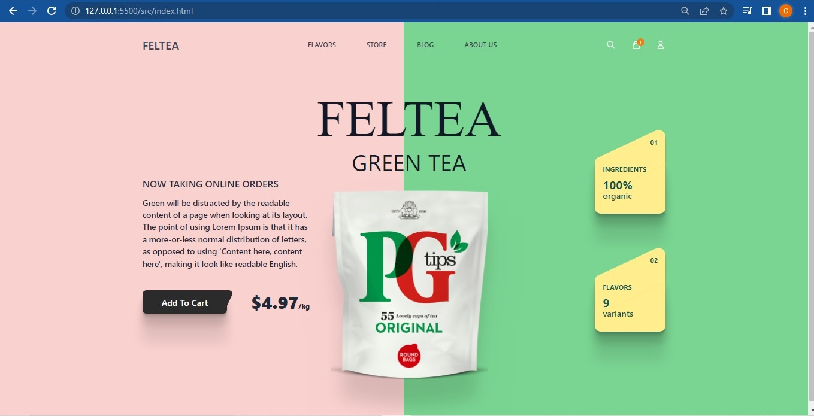

#  🧐 Tailwind CSS Landing Page

> This is a simple product landing page made with Tailwind.css



## 🔧 Built With

- HTML
- CSS
- Tailwind (CSS framework)


## 🛠 Getting Started

To get a local copy up and running follow these simple example steps.

- Go to the main page of te repo.
- Press the ```Code``` button and get the repo link.
- Clone it using git.
- install the package.json file running ```npm install```

## ✒️ Authors

👤 **Ceci Benitez**

- [@Ceci007 GitHub username](https://github.com/Ceci007)